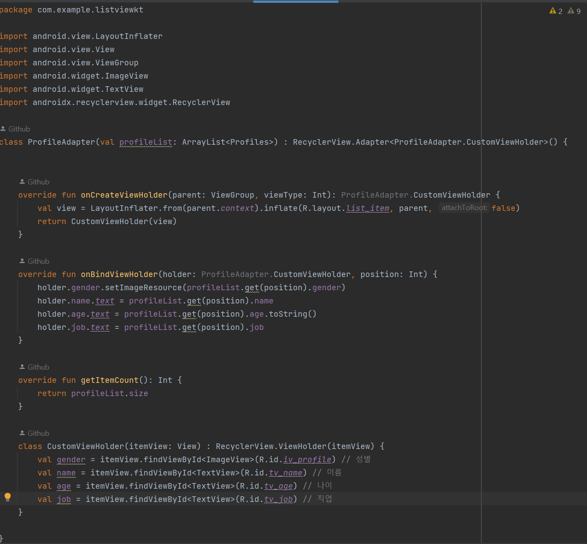
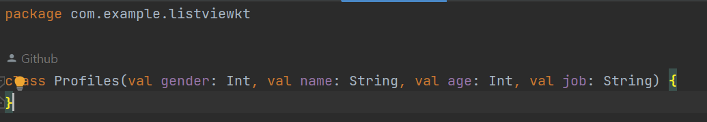
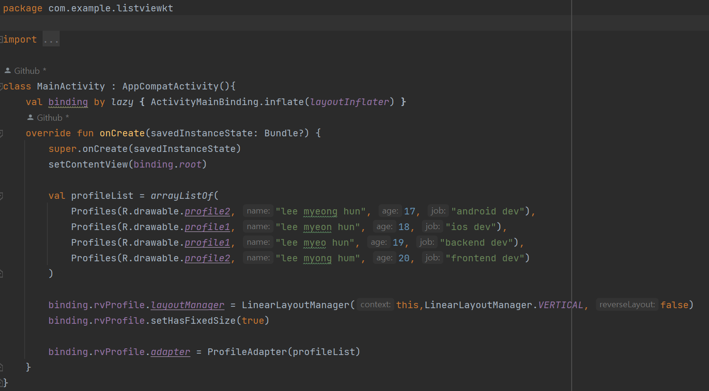

# Android --> recyclerView

## recyclerView

* RecyclerView는 대량의 에이터를 효율적으로 화면에 나타내기 위햐서, 각 아이템을 목록형태로 화면에 나타내는데 사용된다

* ListView와 비슷하긴 하지만 성능개선과 유연함으로 ListView 업그레이드 버전으로 많이 사용된다

* 성능개선
    1. ViewHolder패턴을 기본적으로 구현하도록 하여 스크롤시에 뷰를 재사용함
    2. LayoutManager를 통해서 각 아이템의 배치를 수직, 수행, 격차 등 다양하게 배치할 수 있다

* * *

